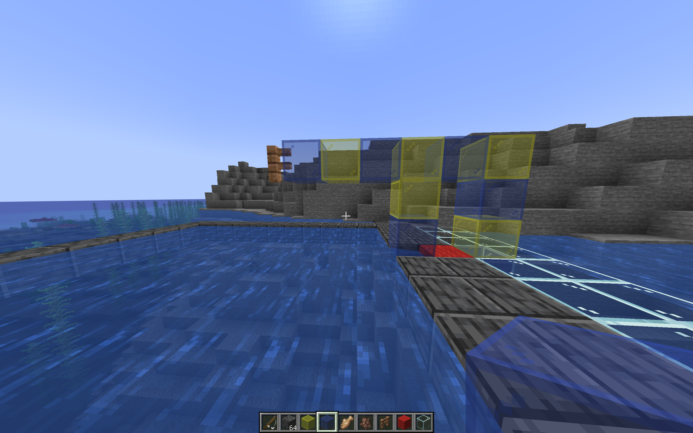
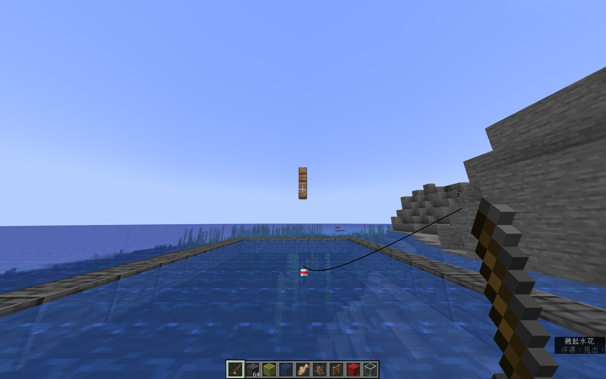

## Minecraft自动钓鱼

> 基于python3的简单自动钓鱼脚本

### 说明

若按照下面操作说明无法正常使用该教本，且屏幕分辨率**不为**2880×1800，则可尝试修改脚本注释处

### 操作

1. 搭建一个类似于这样的结构，红色羊毛处为站立挂机处
   

2. 按住潜行，站在红色羊毛边缘处，十字准星对准木栅栏最下方的深色横纹
   
   
   
2. 抛竿后启动脚本（Linux需ROOT权限）
3. 切回游戏，按下`F11`开启全屏游戏，按下`ctrl`键开始挂机
4. 按下`ESC`键退出脚本

